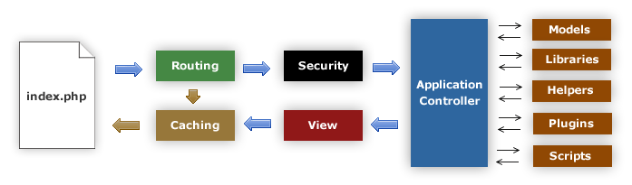

#############
Alur Aplikasi
#############

Grafik berikut menggambarkan bagaimana data mengalir di seluruh sistem:

|CodeIgniter application flow|

#. **Index.php** berfungsi sebagai controller depan, menginisialisasi sumber dasar yang dibutuhkan untuk menjalankan CodeIgniter.
#. *Router* ini meneliti permintaan HTTP untuk menentukan apa yang harus dilakukan dengannya.
#. Jika file *cache* ada, dikirim langsung ke browser, melewati eksekusi sistem normal.
#. Keamanan. Sebelum controller aplikasi dimuat, permintaan HTTP dan setiap pengguna data yang diajukan disaring untuk keamanan.
#. *Controller* memuat *model*, *library* inti, *helper*, dan sumber daya lain yang diperlukan untuk memproses permintaan khusus.
#. *View* yang diselesaikan diberikan kemudian dikirim ke *web browser* untuk dilihat.  Jika caching diaktifkan, *view* di-*cache* terlebih dahulu sehingga pada permintaan selanjutnya dapat disajikan.

